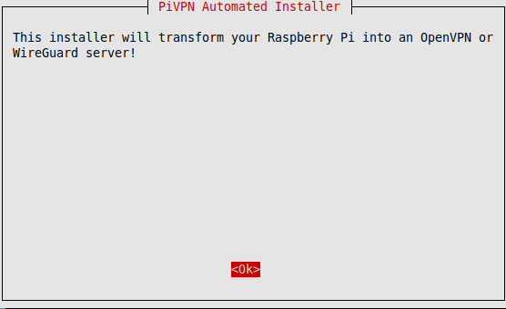
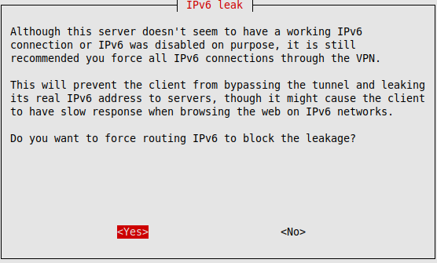
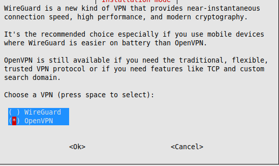
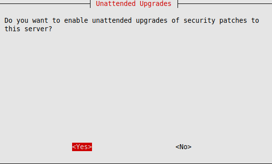
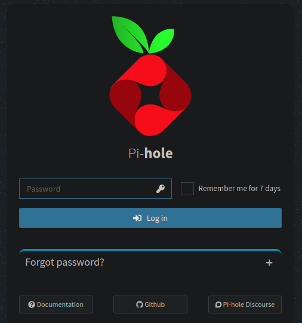

# explain
hi! welcome back, this time i am going to setup a openvpn server on my pi so i can connect to it outside of my network   
we will also be setting up port forwarding on my router

## part (1/3) install
after some quick research i came across a project called [pivpn](https://pivpn.io), it will allow me to easily setup my vpn server   
to start the install i will use the command ```curl -L https://install.pivpn.io | bash```   


    
hit enter on this screen and the next one    


   
i declined this mode due to my router only using IPv4   
after that i agreed to the rest of the options   

   
i selected openvpn as it's the one im most fimmilar with but if you are following this you can select any of them   
i also selected no on the next slide   


it also dected pi-hole and set it to the defualt dns for the server   

   
i decided that the automatic update and upgrade feture would be useful for me as i often forget to keep my packages uptodate (i have a simmilar program i made running on my laptop that does the same thing)   
after a couple more prompts that i hit yes too the install was complete   

## Step (2/3) config
in this step i will setup my user using the command ```sudo pivpn add```   
once it was setup i copied the .ovpn file over to my mechine so i can use it with the command ```scp pi@<ip>:~/opvns/pi.opvn .```

after that i needed to setup portforwarding on my router so i can connect too it outside of the network.   


## Step (3/3) testing
i used the command ```openvpn pi.opvn``` too connect to my system remotley from my mobile hotspot to check if it works and going on [pi.hole](http://pi.hole)   

   
i could conform that it was working as i could login to my pi-hole server.


## Outro
thank you for reading! this has been really fun so far, and the next one [here](https://buffkermitisagod/RPI_SOC/blob/main/splunk/readme.md) where we setup a splunk server and use some other tool to gather information from my network!

